---

## 关于 / About

想用的东西要是没有，或者做得不够好，就自己写一个。

做东西有三条原则 ——

- **本地优先** — 数据放在你自己的硬盘上，不是我的服务器上。
- **零订阅** — 买断或者免费，不接受按月交租。
- **够用就好** — 不堆功能，不为了好看牺牲启动速度。

 

## 工具箱 / Toolbox

 

## 数据 / By the Numbers

 

 

 

## 近期贡献 / Last 13 Weeks

 

## 语言 / Languages

 

## 精选 / Selected Work

| 项目 | 说明 | 技术栈 |
|:---|:---|:---|
| **[drill · 背呗](https://github.com/liu-li-huan-ying/drill)** | 完全离线、零订阅的背单词 App，用 ts-fsrs 做记忆调度，数据全在你自己手机上。 | `Expo` `React Native` `ts-fsrs` |
| **[lucent-newtab](https://github.com/liu-li-huan-ying/lucent-newtab)** | 轻玻璃质感的自定义新标签页：真实照片壁纸 + 导航、搜索、时钟、天气、待办、便签、环境音。零依赖。 | `JavaScript` `HTML` `CSS` |
| **[trailsmith](https://github.com/liu-li-huan-ying/trailsmith)** | Tab Trail + Copy Smith：记录标签页浏览血缘，顺手净化复制来的文本。 | `JavaScript` `MV3` |
| **[GojiDB](https://github.com/liu-li-huan-ying/GojiDB)** | 用 Go 从零实现的 LSM-tree 键值数据库：WAL 预写日志、TTL 过期、压缩策略。 | `Go` |
| **[phantom-video](https://github.com/liu-li-huan-ying/phantom-video)** | 自研 Windows 播放器：libmpv D3D11VA 零拷贝硬解 + SDL2 分层窗口做逐像素透明 UI。 | `C++17` `Win32` `SDL2` |
| **[obsidian-cn-natsort](https://github.com/liu-li-huan-ying/obsidian-cn-natsort)** | 中文数字感知的 Obsidian 文件排序插件 —— 让「第 2 章」排在「第 10 章」前面。 | `TypeScript` |

 

## 正在做 / Currently

- 在博客写点东西：[liu-li-huan-ying.github.io](https://liu-li-huan-ying.github.io)

 

## 最近 / Recently

 

## 联系 / Find Me

- **GitHub**：[@liu-li-huan-ying](https://github.com/liu-li-huan-ying)
- **博客**：[liu-li-huan-ying.github.io](https://liu-li-huan-ying.github.io)
- 有 bug、有想法、或者单纯想聊聊工具怎么做，欢迎开 issue 或者直接邮件我。

 

👀 主页访问次数：

本页数据由 GitHub Actions 每日自动更新 · 最后更新 2026-09-17 10:11 (UTC+8)

